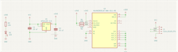

# Lab 3: PCB Design

## Goals
- Reinforce how to do circuit schematics and read data sheets
- How to download and import symbols and footprints
- Learn how to do planes and implement them in KiCAD
- Modifying Edge Cuts
- PCB layout and routing

## Deliverables
Refer to the canvas page [PCB Design Lab](https://canvas.uw.edu/courses/1860902/assignments/10960950) for the deliverables for this lab.

## Lab Prerequisites

- KiCAD installed on your computer

## Useful Resource

- [Youtube KiCAD Tutorial Series](https://www.youtube.com/watch?v=vLnu21fS22s&list=PLUOaI24LpvQPls1Ru_qECJrENwzD7XImd)
- [Digikey Youtube Series](https://www.youtube.com/watch?v=0WCi1rhueH4&list=PLEBQazB0HUyQ5YJSdCBb79orXaR3Uk5vm)
- [Shawn Hymel Youtube Series](https://www.youtube.com/watch?v=vaCVh2SAZY4&list=PL3bNyZYHcRSUhUXUt51W6nKvxx2ORvUQB)
- [How to add a Ground Plane](https://www.youtube.com/watch?v=DNTgrTukltw)
- [PCB Tutorial article](https://www.scs.stanford.edu/~zyedidia/docs/pcb/pcb_tutorial.pdf)
- [Importing Symbols and Footprints](https://forum.kicad.info/t/how-to-get-a-downloaded-symbol-footprint-or-full-library-into-kicad-version-5/19485)
- [SnapEDA footprint and symbol library](https://www.snapeda.com/)
- [Ultra Librarian footprint and symbol library](https://www.ultralibrarian.com/)
- [Tutorial video made by Kevin](https://www.youtube.com/watch?v=3yj_zioqfTA)

## Digikey Links to Components

### Sensors
- [BME280](https://www.digikey.com/en/products/detail/bosch-sensortec/BME280/6136306)
- [SHT45](https://www.digikey.com/en/products/detail/sensirion-ag/SHT45-AD1B-R2/16360966)
- [VL53L4CD](https://www.digikey.com/en/products/detail/stmicroelectronics/VL53L4CDV0DH-1/16123783)
- [VEML770](https://www.digikey.com/en/products/detail/vishay-semiconductor-opto-division/VEML7700-TT/6210690)
- [LSM6DSOX](https://www.digikey.com/en/products/detail/stmicroelectronics/LSM6DSOXTR/9841882?s=N4IgTCBcDaIDIGUCyA2AJgg8gDRAXQF8g)
- [APDS9960](https://www.digikey.com/en/products/detail/broadcom-limited/APDS-9960/5043146)
- [LTR390](https://www.digikey.com/en/products/detail/liteon/LTR-390UV-01/7322497?s=N4IgTCBcDaIDIBUBKBmAnABhAXQL5A)
- [MMC5603](https://www.digikey.com/en/products/detail/memsic-inc/MMC5603NJ/10452796?s=N4IgTCBcDaILJwMIFYBsAGAzCAugXyA)

### Voltage Regulators
- [LM317](https://www.digikey.com/en/products/detail/onsemi/LM317MBSTT3G/1476826)
- [TPS79301](https://www.digikey.com/en/products/detail/texas-instruments/TPS79301DBVR/411988)
- [MIC5376](https://www.digikey.com/en/products/detail/microchip-technology/MIC5376-2-8YC5-TR/1987352)
- [ADP3331](https://www.digikey.com/en/products/detail/analog-devices-inc/ADP3331ARTZ-REEL7/820220?s=N4IgTCBcDaIIIBEAKBmNBGEBdAvkA)

## Instructions:
For this lab, you will design your own [breakout board](https://soldered.com/learn/breakout-boards-what-are-they-and-why-you-should-use-them/) for a sensor assigned to you. Everyone in this class has used a breakout board; the accelerometer you used in your TECHIN512 final project was on a breakout board. You will need to create a circuit schematic and complete the PCB layout for your breakout board. Each student will be assigned an i2c sensor, a voltage regulator, and a footprint size (ex: 0805, 0603, 0402) for their resistors, capacitors, LEDs, etc. Each board will have three parts: the sensor, the voltage regulator, and the LED. Each of those parts has their own resistors or capacitors that you will need to determine for them to work properly. **Check this [PDF](https://github.com/GIXLabs/TECHIN514_W26/blob/main/Lab3_pcb-design/TECHIN514_W26_Component_Assigns.pdf) to see which sensor, voltage regulator, and footprint size has been assigned to you.**

Some i2c sensors have the ability to do both i2c and SPI, you only need to do connections for i2c. Your board should have four header connections for Voltage, Ground, SDA, and SCL. If you cannot find the footprint/symbol for your components on [Digikey](https://www.digikey.com/), we recommend checking SnapEDA or UltraLibrarian. There are additional constraints for your board design listed below.

### Constraints
- Your board must provide regulated power to your sensor and provide 0.1 pin headers to allow your sensor to be connected to a breadboard
- Your board must have a power LED. If the board receives power, the LED turns on
- Your board must use only surface mount (SMD) components (except for the pin headers)
- Your board must have a ground plane on the same side you are placing your components
- The edgecuts (outline of the board) should not have any sharp corners
- Your BOM must be complete include part numbers and package information

## Example

Here is an example of a breakout board using an MLX90393 Magnetometer under the same contraints.

Schematic:

PCB Layout:

Manufactured Board:

