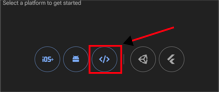
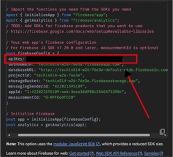
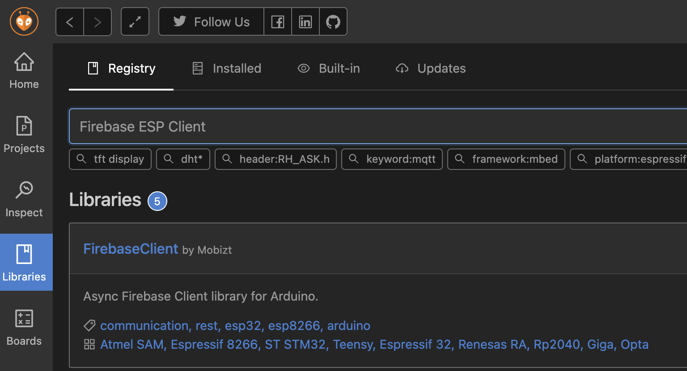

# Lab 5 - Power Management Lab

## Lab Prerequisites

- ESP32 (x1)
- USB-C cable for ESP32 (x1)
- Power Profiler Kit II (one kit per group of 3)
- Micro-USB cable for Power Profiler Kit (one cable per group)
- HC-SR04 Ultrasonic Sensor (x1)
- Jumper Cables
- Breadboard

## Goals

In this lab, you'll learn the basics about how to measure the power consumption of your Seeeduino XIAO ESP32S3 microcontroller in differeng usage scenarios. You'll also learn how to develop your own strategy of keeping your microcontroller to be energy-friendly.


* Connect your ESP32S3 to the UW MPSK Wifi
* Establish connection between your ESP32S3 and Firebase Realtime Database (RTDB)
* Transmitting your data from your device to the RTDB
* Use nRF Power Profiler and its kit to measure the power consumption of your ESP32S3
* Developing your own strategy based on different *mode* of ESP32S3 to save energy

### Some useful external resources:

* [nRF Connect Download](https://www.nordicsemi.com/Products/Development-tools/nRF-Connect-for-Desktop/Download#infotabs)
* [J-Link Download Page](https://www.segger.com/downloads/jlink/)
* [UW MPSK Setup Instructions](https://itconnect.uw.edu/tools-services-support/networks-connectivity/uw-networks/campus-wi-fi/uw-mpsk/)
* [Firebase Setup Instructions](https://randomnerdtutorials.com/esp32-firebase-realtime-database/)
* [ESP32 Deep Sleep](https://randomnerdtutorials.com/esp32-deep-sleep-arduino-ide-wake-up-sources/)

## Deliverables

**Submit a pdf with all of the following:**

### Transmitting your HC-SR04 Data to Firebase

* ✏️ Take a screenshot on your Firebase RTDB's webpage to show that your data has been successfully uploaded.

### Power Consumption Measuring

* ✏️ Take a screenshot of the plot on your power profiler app to show the power consumption change during a **1 minute time window with 5 different *mode or stages (Deep Sleep, Idle, Ultrasonic reading, Ultrasonic + BLE, Ultrasonic + WiFi)*** for the ESP32. Annnotate what each stage stands for.
* ✏️ Set the time window **from 1 minute to 10 seconds** and take a screenshot for *each* mode/stage. Calculate how long would a 500mAh battery last when the ESP32S3 is in each mode/stage.
* ✏️ Update your code to change the data transmission rates for BLE and WiFi and measure how the power consumption changes. Take a screenshot of the power consumption plots for both BLE and WiFi. Make plots for BLE and WiFi that show the relationship between transmission rates and average current used. Calculate how long a 500mAh battery would last for these new transmission rates.

### Create your own power-saving strategy

* ✏️ Describe your own policy/strategy for both BLE and WiFi to make sure a 500mAh battery can support it without being recharged for at least 24 hours
* ✏️ Implement both your strategies for BLE and WiFi. Simulate your use case and take a screenshot of the power consumption for BLE and WiFi. Annotate each stage on the plot. Calculate how long the battery will last for both your strategies.
* ✏️ Upload your code to GitHub. Add a link to your repo in the pdf.


## **1. Find the MAC address of your ESP32**

These instructions are also located on this [website](https://randomnerdtutorials.com/get-change-esp32-esp8266-mac-address-arduino/)

```arduino
// Complete Instructions to Get and Change ESP MAC Address: https://RandomNerdTutorials.com/get-change-esp32-esp8266-mac-address-arduino/
#include <Arduino.h>
#include <WiFi.h>

void setup(){
  Serial.begin(115200);
  while(!Serial);
  delay(1000);
  WiFi.begin();
  Serial.println();
  Serial.print("ESP Board MAC Address:  ");
  Serial.println(WiFi.macAddress());
}
 
void loop(){
  Serial.println(WiFi.macAddress());
  delay(1000);
}
```

## 2. Configure your ESP32 to work on the UW MPSK WiFi network

Follow the instructions on UW’s IT Connect [website](https://itconnect.uw.edu/tools-services-support/networks-connectivity/uw-networks/campus-wi-fi/uw-mpsk/):


The output should look like this if the device was successfully generated.

## 3. Confirm that your ESP32 is connected to the UW MPSK wifi

```arduino
#include <WiFi.h>

const char* ssid     = "UW MPSK";
const char* password = "your_PASSWORD"; // Replace with your password received from UW MPSK

void setup() {
  Serial.begin(115200);
  while(!Serial);
  delay(1000);
  // Connect to WiFi
  WiFi.begin(ssid, password);
  Serial.print("Connecting to WiFi");
  while (WiFi.status() != WL_CONNECTED) {
    delay(1000);
    Serial.print(".");
  }
  Serial.println("");
  Serial.println("Connected to WiFi");
}

void loop() {
  // Test WiFi connection
  if(WiFi.status() == WL_CONNECTED) {
    Serial.println("WiFi is still connected");
  } else {
    Serial.println("WiFi connection lost");
  }
  
  delay(5000); // Wait for 5 seconds before checking again
}
```

## 4. Set up a Firebase account

Follow the instructions from **step 1 to 3** in the link [here](https://randomnerdtutorials.com/esp32-firebase-realtime-database/). You will also need the api key for your Firebase project.

Click on the gear next to Project Overview and click on general.


At the bottom of the general settings tab you should see the option to connect to iOS, Android, or Web app. Select web app.



You will be prompted to give your app a nickname, you can give it any name you like. Then click on the register app button. You do not need to select the option to set up Firebase Hosting. After you have registered your app you can click the button to return to console. You will find the api key for your Firebase app here.



**NOTE:** API Keys should never be publicly available. Make sure when you upload your code to Github that all API keys, log in, and user info is removed. There are many bots that scrape through Github looking for sensitive information that has not been removed or obfuscated.

The Firebase-ESP-Client Library mentioned in the previous link is deprecated. Install FirebaseClient library instead.


Here is some example code you can run to see if you have set up your Firebase correctly. You will need to input information that you have previous set up such as WiFi credentials, user email and password, Firebase RTDB URL, and the API Key. This example code should upload test data of various types every fifteen seconds. Make sure to take a look at the code and try and understand what functions and methods it is using to upload data to Firebase. Alternatively, you can put it into your favorite LLM and have it understand it for you. 🤡

```arduino
#include <Arduino.h>
#if defined(ESP32) || defined(ARDUINO_RASPBERRY_PI_PICO_W)
#include <WiFi.h>
#elif __has_include(<WiFiNINA.h>)
#include <WiFiNINA.h>
#elif __has_include(<WiFi101.h>)
#include <WiFi101.h>
#elif __has_include(<WiFiS3.h>)
#include <WiFiS3.h>
#endif

#include <Firebase_ESP_Client.h>

// Provide the token generation process info.
#include <addons/TokenHelper.h>

// Provide the RTDB payload printing info and other helper functions.
#include <addons/RTDBHelper.h>

/* 1. Define the WiFi credentials */
#define WIFI_SSID "UW MPSK"
#define WIFI_PASSWORD ""

// For the following credentials, see examples/Authentications/SignInAsUser/EmailPassword/EmailPassword.ino

/* 2. Define the API Key */
#define API_KEY ""

/* 3. Define the RTDB URL */
#define DATABASE_URL "" //<databaseName>.firebaseio.com or <databaseName>.<region>.firebasedatabase.app

/* 4. Define the user Email and password that alreadey registerd or added in your project */
#define USER_EMAIL ""
#define USER_PASSWORD ""

// Define Firebase Data object
FirebaseData fbdo;

FirebaseAuth auth;
FirebaseConfig config;

unsigned long sendDataPrevMillis = 0;

unsigned long count = 0;

#if defined(ARDUINO_RASPBERRY_PI_PICO_W)
WiFiMulti multi;
#endif

void setup()
{

  Serial.begin(115200);

#if defined(ARDUINO_RASPBERRY_PI_PICO_W)
  multi.addAP(WIFI_SSID, WIFI_PASSWORD);
  multi.run();
#else
  WiFi.begin(WIFI_SSID, WIFI_PASSWORD);
#endif

  Serial.print("Connecting to Wi-Fi");
  unsigned long ms = millis();
  while (WiFi.status() != WL_CONNECTED)
  {
    Serial.print(".");
    delay(300);
#if defined(ARDUINO_RASPBERRY_PI_PICO_W)
    if (millis() - ms > 10000)
      break;
#endif
  }
  Serial.println();
  Serial.print("Connected with IP: ");
  Serial.println(WiFi.localIP());
  Serial.println();

  Serial.printf("Firebase Client v%s\n\n", FIREBASE_CLIENT_VERSION);

  /* Assign the api key (required) */
  config.api_key = API_KEY;

  /* Assign the user sign in credentials */
  auth.user.email = USER_EMAIL;
  auth.user.password = USER_PASSWORD;

  /* Assign the RTDB URL (required) */
  config.database_url = DATABASE_URL;

  /* Assign the callback function for the long running token generation task */
  config.token_status_callback = tokenStatusCallback; // see addons/TokenHelper.h

  
  // Comment or pass false value when WiFi reconnection will control by your code or third party library e.g. WiFiManager
  Firebase.reconnectNetwork(true);

  // Since v4.4.x, BearSSL engine was used, the SSL buffer need to be set.
  // Large data transmission may require larger RX buffer, otherwise connection issue or data read time out can be occurred.
  fbdo.setBSSLBufferSize(4096 /* Rx buffer size in bytes from 512 - 16384 */, 1024 /* Tx buffer size in bytes from 512 - 16384 */);

  // Limit the size of response payload to be collected in FirebaseData
  fbdo.setResponseSize(2048);

  Firebase.begin(&config, &auth);

  // The WiFi credentials are required for Pico W
  // due to it does not have reconnect feature.
#if defined(ARDUINO_RASPBERRY_PI_PICO_W)
  config.wifi.clearAP();
  config.wifi.addAP(WIFI_SSID, WIFI_PASSWORD);
#endif

  Firebase.setDoubleDigits(5);

  config.timeout.serverResponse = 10 * 1000;

}

void loop()
{

  // Firebase.ready() should be called repeatedly to handle authentication tasks.

  if (Firebase.ready() && (millis() - sendDataPrevMillis > 15000 || sendDataPrevMillis == 0))
  {
    sendDataPrevMillis = millis();

    Serial.printf("Set bool... %s\n", Firebase.RTDB.setBool(&fbdo, F("/test/bool"), count % 2 == 0) ? "ok" : fbdo.errorReason().c_str());

    Serial.printf("Get bool... %s\n", Firebase.RTDB.getBool(&fbdo, FPSTR("/test/bool")) ? fbdo.to<bool>() ? "true" : "false" : fbdo.errorReason().c_str());

    bool bVal;
    Serial.printf("Get bool ref... %s\n", Firebase.RTDB.getBool(&fbdo, F("/test/bool"), &bVal) ? bVal ? "true" : "false" : fbdo.errorReason().c_str());

    Serial.printf("Set int... %s\n", Firebase.RTDB.setInt(&fbdo, F("/test/int"), count) ? "ok" : fbdo.errorReason().c_str());

    Serial.printf("Get int... %s\n", Firebase.RTDB.getInt(&fbdo, F("/test/int")) ? String(fbdo.to<int>()).c_str() : fbdo.errorReason().c_str());

    int iVal = 0;
    Serial.printf("Get int ref... %s\n", Firebase.RTDB.getInt(&fbdo, F("/test/int"), &iVal) ? String(iVal).c_str() : fbdo.errorReason().c_str());

    Serial.printf("Set float... %s\n", Firebase.RTDB.setFloat(&fbdo, F("/test/float"), count + 10.2) ? "ok" : fbdo.errorReason().c_str());

    Serial.printf("Get float... %s\n", Firebase.RTDB.getFloat(&fbdo, F("/test/float")) ? String(fbdo.to<float>()).c_str() : fbdo.errorReason().c_str());

    Serial.printf("Set double... %s\n", Firebase.RTDB.setDouble(&fbdo, F("/test/double"), count + 35.517549723765) ? "ok" : fbdo.errorReason().c_str());

    Serial.printf("Get double... %s\n", Firebase.RTDB.getDouble(&fbdo, F("/test/double")) ? String(fbdo.to<double>()).c_str() : fbdo.errorReason().c_str());

    Serial.printf("Set string... %s\n", Firebase.RTDB.setString(&fbdo, F("/test/string"), F("Hello World!")) ? "ok" : fbdo.errorReason().c_str());

    Serial.printf("Get string... %s\n", Firebase.RTDB.getString(&fbdo, F("/test/string")) ? fbdo.to<const char *>() : fbdo.errorReason().c_str());

    // For the usage of FirebaseJson, see examples/FirebaseJson/BasicUsage/Create_Edit_Parse.ino
    FirebaseJson json;

    if (count == 0)
    {
      json.set("value/round/" + String(count), F("cool!"));
      json.set(F("value/ts/.sv"), F("timestamp"));
      Serial.printf("Set json... %s\n", Firebase.RTDB.set(&fbdo, F("/test/json"), &json) ? "ok" : fbdo.errorReason().c_str());
    }
    else
    {
      json.add(String(count), F("smart!"));
      Serial.printf("Update node... %s\n", Firebase.RTDB.updateNode(&fbdo, F("/test/json/value/round"), &json) ? "ok" : fbdo.errorReason().c_str());
    }

    Serial.println();

   
    count++;
  }
}


```
## 5. Write Code to implement different power consumption modes/stages

Once you have a successfully been able to send data to Firebase, write a program that has the ESP32 go through five different modes/stages. In each mode/stage the ESP32 will consume different amounts of power. Each mode/stage should last for 10-12 seconds. The five modes/stages are: Deep Sleep, Idle, Ultrasonic readings, Ultrasonic + BLE + send to another ESP32, and Ultrasonic + WiFi + sent to Firebase. For more information on how to put the ESP32 into deep sleep mode and the different ways to wake it up, please refer to the link in the external resources section at the top of this page.
## 5. Download nRF Connect for Desktop and J-Link Configurator (if you have not done so already)

Find the software on this [website](https://www.nordicsemi.com/Products/Development-tools/nRF-Connect-for-desktop/Download#infotabs) and then install the Power Profiler App to connect with the Power Profiler Kit (see image below). Also, install the J-LINK Configurator software. The link of downloading J-LINK is [here](https://www.segger.com/downloads/jlink/).

**Note: For Macs with Apple Silicon, use the `Universal Installer`**


After you install “Power Profiler,” open it to see the following interface:


## 6. Connect your ESP32 circuit to your Power Profiler Kit and view power consumption through the Power Profiler App

First, build a small circuit by connecting your ultrasonic sensor to your ESP32. Ensure that the sensor is working properly by printing the measured distance in your serial monitor.

Next, connect your ESP32 to the Power Profiler Kit (PPK), as shown in the figure below. Connect the Vout and GND pin of the PPK to the 5V and GND pin of your ESP32. Make sure that all devices and peripherals have a common ground connection.


**NOTE: The PPK will provide power to your ESP32. Make sure that your ESP32 is NOT connected by USB to your computer at the same time the PPK is supplying power.**

The PPK will provide power to your ESP32 and ultrasonic sensor. Select the “USB DATA/POWER” port on the Power Profiler Kit. Turn the button on.


NOTE : You should connect your micro-USB into the `USB DATA/Power` port.

Next, turn on the Power Profiler App and select the PPK you just connected. Program the device if prompted.


Next, ensure that the settings on your Power Profiler App match the settings in the image below.

1. Choose source meter mode
2. Set the supply voltage to 5V
3. Set sample rate to 1000Hz
4. Click start
5. Enable power output


If everything is working properly, you should see a visualization of the measurement of power consumption, as the following figure shows (the values can be different). This visualization is the power consumption over time.


Take a screenshot of the power consumption visualization over one minute.

Annotate, like above, the key moments on the screenshot which depict the events which consume different amounts of power. These events are:

1. Idle ESP32 (not running WiFi/BLE or ultrasonic sensor)
2. Only ultrasonic sensor working
3. Ultrasonic + BLE + Sending data to another ESP32
4. Ultrasonic + Wifi + Sending data to Firebase
5. Deep Sleep mode

Record the average current for each mode/stage above, and estimate how long would a 500mAh battery last if the device is kept being used under each mode.

## 7. Estimate the battery life for different use cases

Using the window duration selector at the top of the Power Profiler App, change the time window to 3 or 10 seconds. For each of the five power-consumption use cases described above, wait until the window is filled with only the power consumption curve that is unique to each use case.

Take a screenshot of the power consumption curve and the average power consumption for each use case.


A typical ‘[ADAFRUIT INDUSTRIES 1578 Lithium Ion Polymer Battery](https://www.adafruit.com/product/1578)’ has a capacity of 500mAh, which means that it can support a system running at 500 mA for 1 hour.

Estimate how long the battery would support each of the five use cases before dying. For example, if the average current is 50mA, then the battery can last for 10 hours (500mAh / 50mA = 10 hours).

Rewrite the Arduino code to transmit your ultrasonic sensor data to another ESP32 (BLE) and Firebase (WiFi) at the five following rates:

1. 2 times per second (2 Hz)
2. 1 time per second (1 Hz)
3. Once every 2 seconds (0.5 Hz)
4. Once every 3 seconds (0.333 Hz)
5. Once every 4 seconds (0.25 Hz)

Identify what the power consumption (use average current multiplied by the voltage, unit in Watt, W) is for each of the five different data transmission rates. Plot a graph with Excel or Google Sheets to find the correlation between the data transmission rate and power consumption.

Zoom in the window to read the averaged current on your Power Profiler app, and estimate how long a 500mAh battery would support each of the five different data transmission rates.

## 8. Create your own power consumption guidelines for the ESP32 and ultrasonic sensor

Given the insights that you have gained thus far, create your own power consumption guidelines for a battery-powered device. This ESP32-enabled device must use an ultrasonic sensor to measure distance and transmit that distance data. The device must operate for **24 hours** on a single 500mAh battery. Do this for BLE and WiFi.

Assume that this device is designed to detect whether or not an object (or person) has moved in front of the ultrasonic sensor in a room. The results of that detection should be uploaded to the Firebase cloud database. Rewrite the Arduino code to develop new power consumption guidelines for this new device. There are several variables that you can change, including deep sleep duration and frequency, or the data transmission rate, among others. For example, you can develop a policy such as *“If the ultrasonic sensor’s readout is greater than 50cm for 30 seconds, turn the ESP32 to sleep mode for 30 seconds.”*

Upload the code onto your ESP32, reconnect the Power Profiler Kit, and take a screenshot of a 1-minute window of the power consumption visualization. Make sure that your screenshot includes at least the deep-sleep mode and the working mode of your device. Include the average current in the screenshot. Finally, estimate your strategy's power consumption for 24 hours under your simulated scenario, and prove that it can be supported by a 500mAh battery without recharging. Annotate any notable changes in current on the visualization, and summarize the guidelines you’ve developed.
