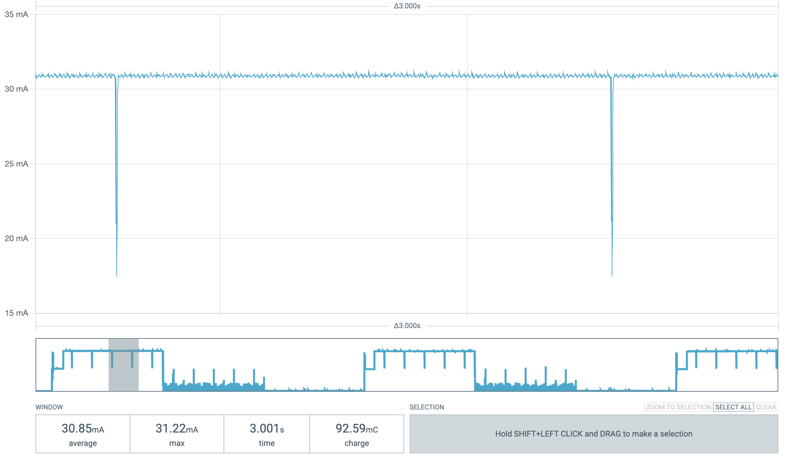
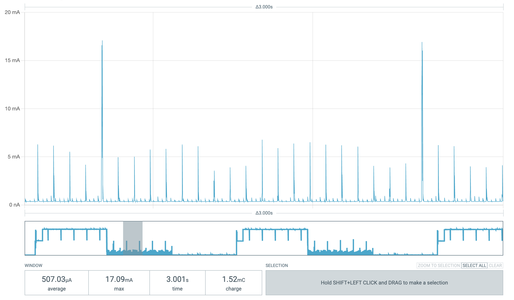
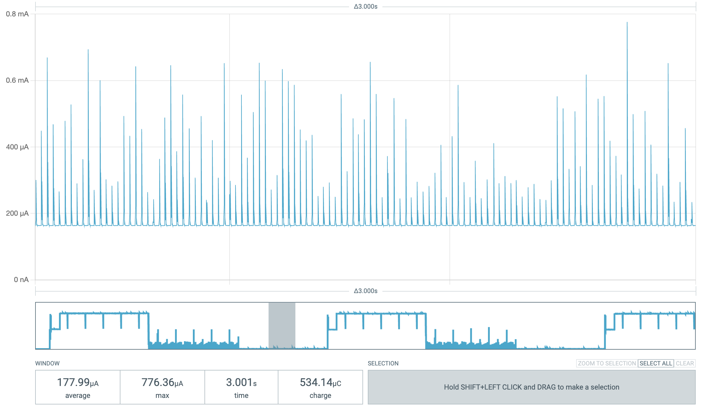
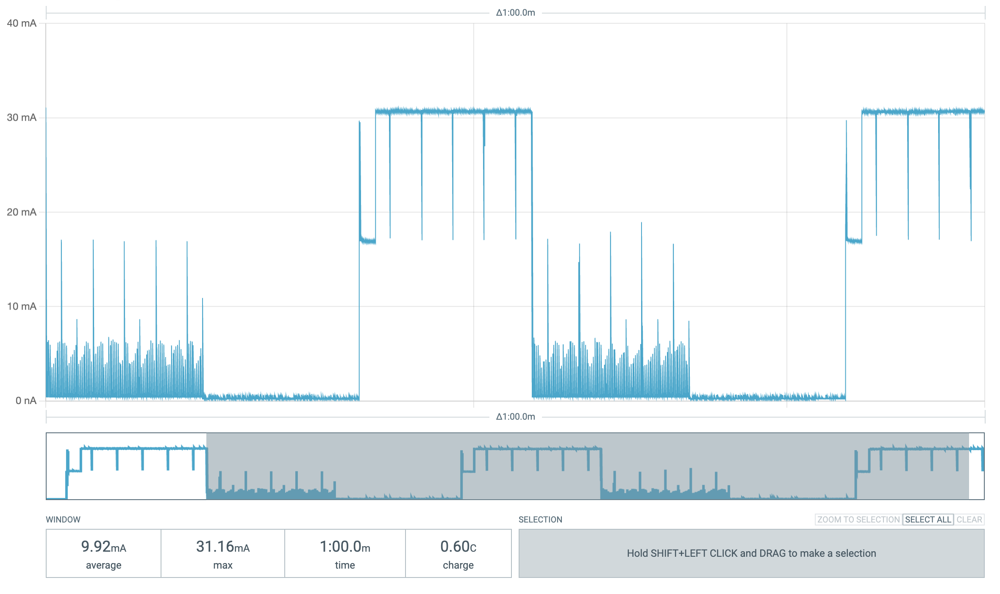

## ESP32C3 Power Consumption Chart

| Mode | Avg Current (mA) | Avg Power 5V (mW) |
|------|------------------|---------------------|
| Active | 30.85 | 154.25 |
| Idle | 0.507 | 2.535 |
| Sleep | 0.178 | 0.890 |

### Active

### Idle

### Sleep

### 1min
