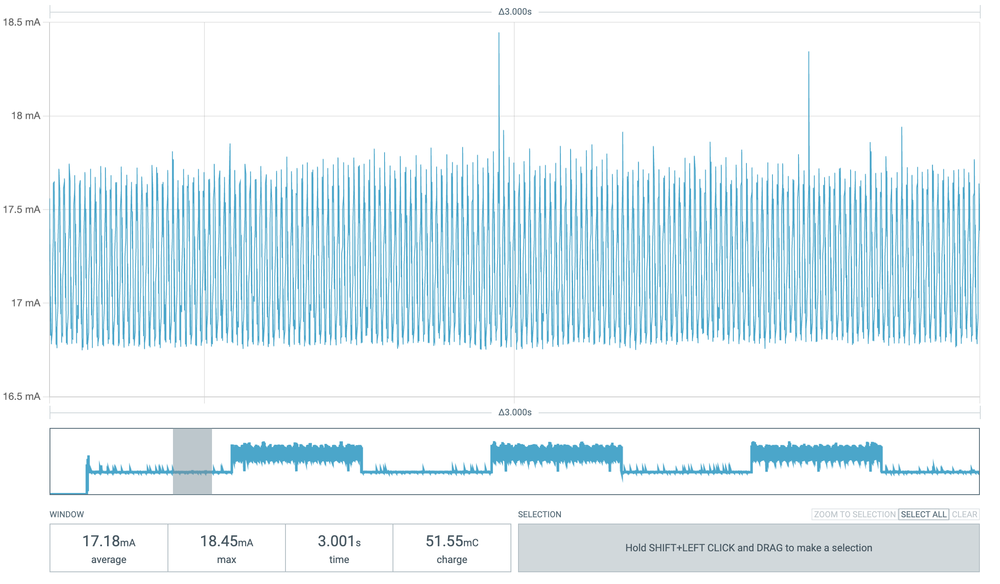
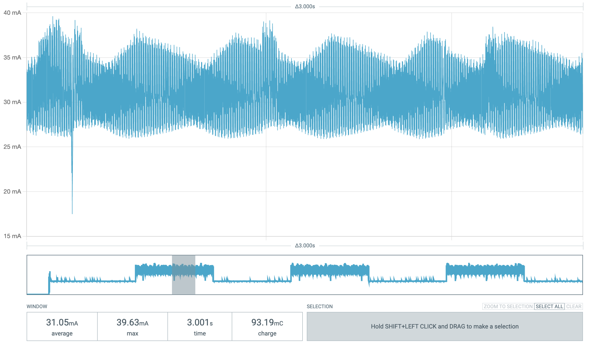
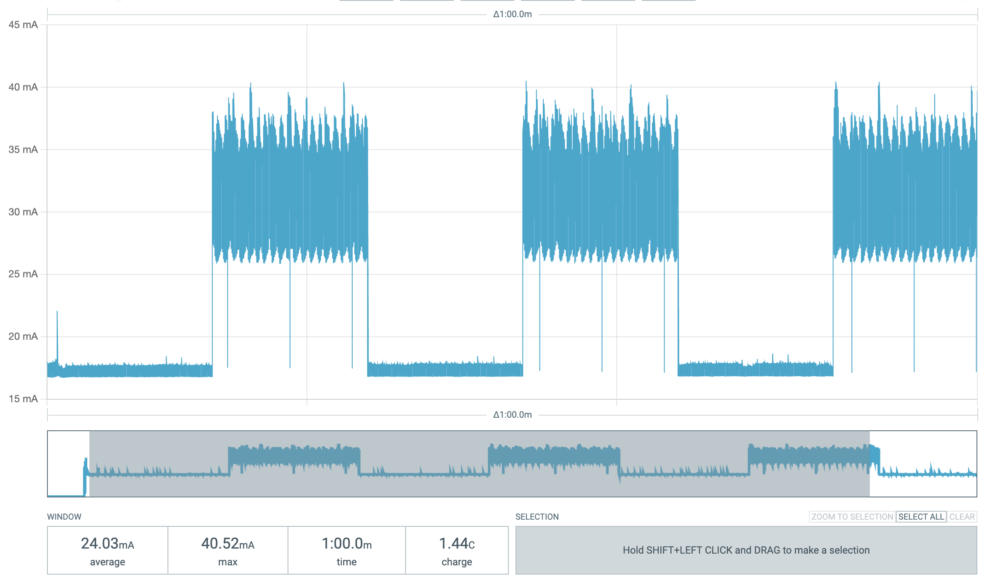

## Power Consumption Chart

| Mode | Avg Current (mA) | Avg Power 5V (mW) |
|------|------------------|---------------------|
| Standby| 17.18 | 85.9 |
| On | 31.05 | 155.3 |

### Standby Mode

### On Mode

### 1 min average
